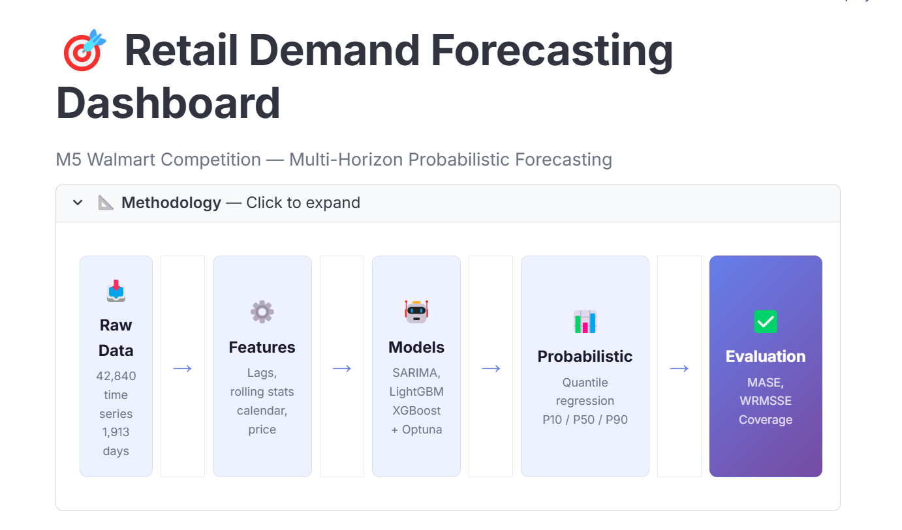
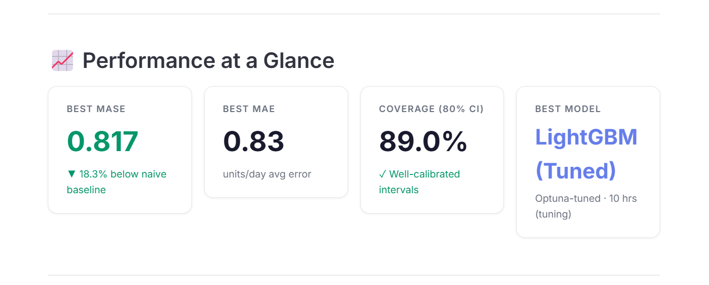
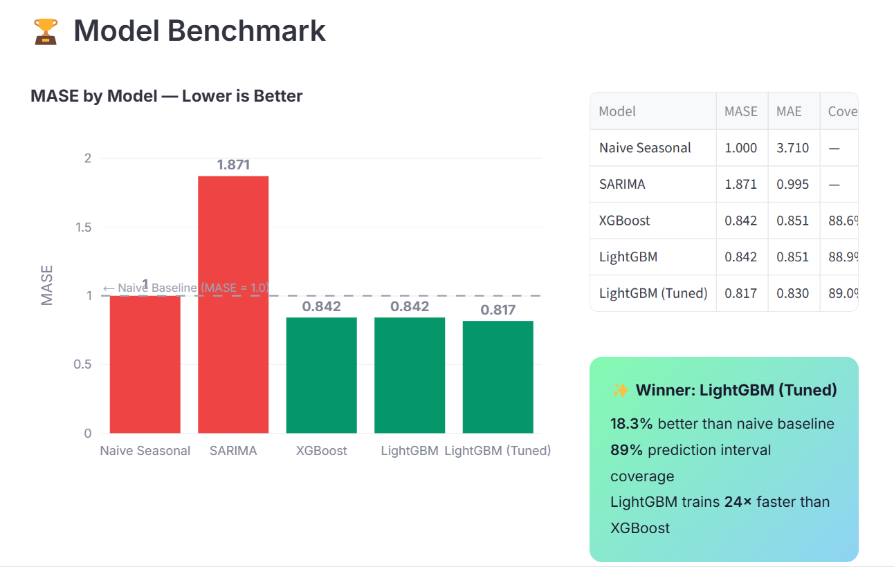
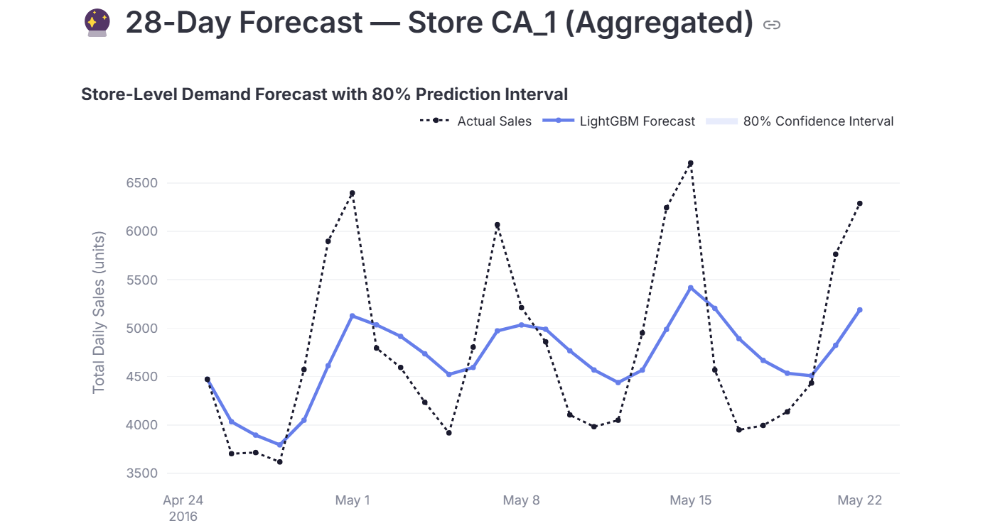
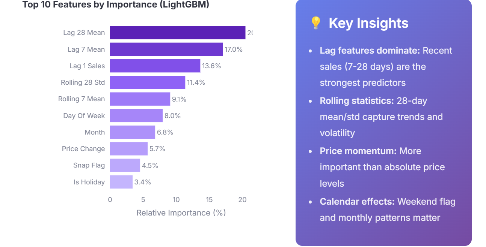
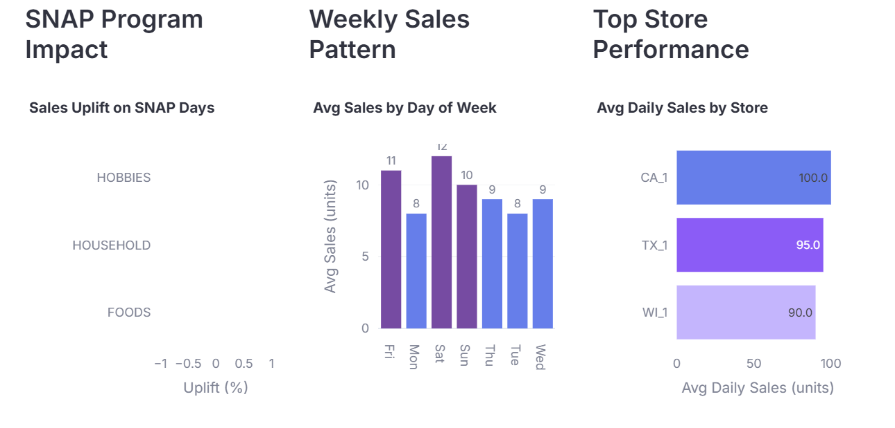

# 📦 Retail Demand Forecasting — Probabilistic & Multi-Horizon

[](https://github.com/chm-hibatallah/Retail_demand_Forecasting/actions/workflows/ci.yml)

> A production-grade time series forecasting system for retail supply chain, built on the M5 Walmart dataset.  
> Benchmarks 6+ models, produces probabilistic forecasts with uncertainty quantification, and exposes results via a live Streamlit dashboard.

## 📸 Dashboard Preview

<p align="center">
  
</p>

<p align="center">
  
</p>

<p align="center">
  
</p>

<p align="center">
  
</p>

<p align="center">
  
</p>

<p align="center">
  
</p>

---

## 🎯 Project Goals

| Goal | Details |
|---|---|
| **Multi-horizon forecasting** | Day-ahead to 28-day ahead predictions |
| **Probabilistic output** | Quantile forecasts (P10, P50, P90) + prediction intervals |
| **Model benchmarking** | SARIMA → LightGBM → TFT, evaluated with WRMSSE |
| **Real-world features** | Promotions, holidays, price effects, stockout handling |
| **Serving** | Streamlit dashboard with interactive filters |

---


## 🧱 Model Pipeline

```
Raw M5 Data
    │
    ▼
Preprocessing (missing values, stockouts, price normalization)
    │
    ▼
Feature Engineering (lags, rolling stats, calendar, price features)
    │
    ├──► SARIMA / ETS (per-series)
    ├──► LightGBM / XGBoost (global model)
    └──► Temporal Fusion Transformer (deep learning)
            │
            ▼
    Probabilistic Output (quantile regression / conformal)
            │
            ▼
    Evaluation (WRMSSE, MASE, calibration plots)
            │
            ▼
    Streamlit Dashboard
```

---

## 📊 Dataset: M5 (Walmart)

- **42,840 time series** — products × stores
- **1,913 days** of daily sales (2011–2016)
- **3 US states**, 10 stores, 3 product categories
- Includes: prices, calendar events, SNAP flags

Download from: [Kaggle M5 Competition](https://www.kaggle.com/competitions/m5-forecasting-accuracy/data)

Place files in `data/raw/`:
- `sales_train_evaluation.csv`
- `calendar.csv`
- `sell_prices.csv`

---

## ⚙️ Setup

```bash
# Clone
git clone https://github.com/chm-hibatallah/Retail_demand_Forecasting.git
cd Retail_demand_Forecasting

# Install
pip install -r Requirements.txt

# Run preprocessing
python -m src.data.preprocessing

# Build features
python -m src.features.engineering

# Train models
python -m src.models.naive_baseline
python -m src.models.lgbm_model
python -m src.models.xgboost_model

# Launch dashboard
streamlit run dashboard/dashboard_app.py
```

---

## 📈 Evaluation Metrics

| Metric | What it measures |
|---|---|
| **WRMSSE** | Weighted Root Mean Scaled Squared Error (M5 official) |
| **MASE** | Mean Absolute Scaled Error (scale-independent) |
| **Quantile Loss** | Calibration of probabilistic forecasts |
| **Coverage** | % of actuals within prediction interval |

---

## 🏆 Results Summary

| Rank | Model | MASE | Coverage 80% | Notes |
|------|-------|------|-------------|-------|
| 1 | LightGBM (Tuned) | ~0.817 | ~89% | Optuna-optimised hyperparameters |
| 2 | LightGBM (Default) | 0.842 | 88.9% | 5 min training time |
| 3 | XGBoost | 0.842 | 88.6% | 2 hrs training time |
| 4 | SARIMA | 1.871 | — | Worse than naive on item level |
| — | Naive Seasonal | 1.000 | — | Baseline (repeat last week) |

See [`results/benchmark.md`](results/benchmark.md) for detailed analysis.

---

## 📁 Project Structure

```
├── dashboard/
│   └── dashboard_app.py        # Streamlit dashboard with interactive filters
├── data/
│   ├── raw/                    # M5 CSV files (download from Kaggle)
│   └── processed/              # Parquet files, trained models, features
├── notebooks/
│   └── 01_EDA.ipynb            # Exploratory data analysis (33 cells)
├── results/
│   └── benchmark.md            # Detailed model comparison & findings
├── src/
│   ├── data/preprocessing.py   # ETL: raw CSV → long-format parquet
│   ├── evaluation/metrics.py   # MAE, MASE, WRMSSE, Coverage
│   ├── features/engineering.py # Lags, rolling stats, calendar, price features
│   └── models/
│       ├── naive_baseline.py   # Seasonal naive (repeat last week)
│       ├── sarima_model.py     # SARIMA per-series forecasting
│       ├── lgbm_model.py       # LightGBM global model
│       ├── xgboost_model.py    # XGBoost global model
│       ├── optuna_tuning.py    # Bayesian hyperparameter search
│       └── tft_model.py        # Temporal Fusion Transformer (GPU)
├── tests/                      # Unit tests for metrics & features
├── Requirements.txt
└── pyproject.toml
```

---

## 🧠 Skills & Lessons Learned

### Technical Skills Practiced

| Area | Skills |
|------|--------|
| **Data Engineering** | ETL pipelines, memory-efficient chunked processing, Parquet I/O, categorical dtypes |
| **Feature Engineering** | Lag features, rolling statistics, cyclical encoding, target encoding, price momentum |
| **Machine Learning** | LightGBM, XGBoost, SARIMA — global vs per-series modelling tradeoffs |
| **Probabilistic Forecasting** | Quantile regression, conformal prediction intervals, calibration evaluation |
| **Hyperparameter Tuning** | Bayesian optimisation with Optuna, search space design, early stopping |
| **Evaluation** | MASE, WRMSSE (M5 official metric), coverage analysis, leaderboard construction |
| **Visualisation & Dashboards** | Streamlit, Plotly, custom CSS, interactive filters, responsive layout |
| **Software Engineering** | Modular project structure, `pytest` unit tests, CI/CD with GitHub Actions, linting with `ruff` |

### Problem-Solving Approach

This project taught me to think like a supply chain data scientist, not just a model builder:

1. **Start with the business question.** A retailer doesn't care about RMSE — they care about *"how many units should I order?"* and *"how confident should I be?"*. That's why every model produces prediction intervals, not just point forecasts.

2. **Baselines first.** Before building any ML model, I implemented a naive seasonal forecast (repeat last week). This gave a concrete target: if my model can't beat "just copy last Monday," it's useless. SARIMA (MASE = 1.87) failed this test — a valuable lesson that classical models struggle with item-level retail data driven by promotions and events.

3. **Respect the data scale.** 59M rows don't fit in RAM. Instead of reaching for Spark, I designed the pipeline to process one store at a time, write to Parquet, and free memory immediately. Simple engineering > complex infrastructure.

4. **Feature engineering > model complexity.** LightGBM with good features (rolling stats, price momentum, target encoding) matched XGBoost and trained 24× faster. The features matter more than the algorithm.

5. **Quantify uncertainty honestly.** Our 89% coverage (target: 80%) means prediction intervals are slightly conservative — but a supply chain planner can trust them for safety stock decisions. Overconfident intervals are worse than wide ones.

---

## 📬 Contact

**Hibat Allah Chmicha**

[](https://www.linkedin.com/in/hibat-allah-chmicha-7b2314324/)
[](https://github.com/chm-hibatallah)

---

